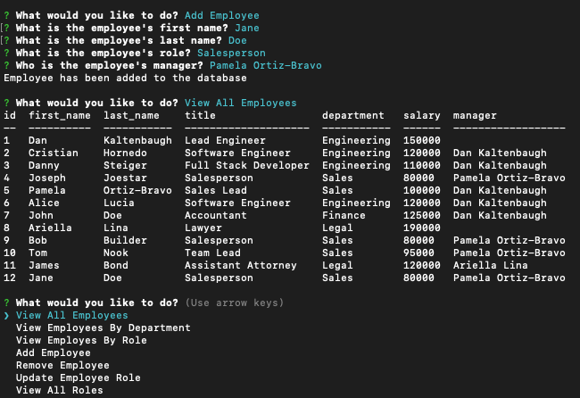

# Employee-Tracker

## Table of Contents

1. [Documentation](#documentation)

   1. [Description](#description)
   2. [Installation Instructions](#Installation)
   3. [Usage Information](#usage)

2. [Test Instructions](#test)
3. [Contribution Guideline](#contribution)
4. [License](#license)
5. [Questions](#questions)

## Documentation 

### Description 

- A Command-Line Application that interacts with the MySQL database and allows the user to populate the database with adding a department, roles and employees . Furthermore it will allow you to view and update these as well.

### Installation Instructions 

- To install the project click the green button that says code. Copy the link and go to your terminal. Put "git clone" and then paste the link. When you have the project all set, go to the project in your terminal and put "npm i" to install all of the dependencies for it to work.

- Be sure to have a MySQL database so you can copy the schema and seeds to populate the tables in the database so you can have data for this to work as well... Put in your password for your database in the files that have a **mysql.createConnection**

### Usage Information 

- Since this is a Command Line Interface you will have to type either "node app.js" or "npm run start" to use the project.

## Test Instructions 

- There is no way to test right now but you are more than welcomed to add your own tests for if you decide to add more functionality to the program.

## Contribution Guideline 

- Check on the source code to implement some faster or more efficient ways to make the code run smoother or add new features and leave a descriptive pull request with what you have done and why.

## License 

- This Application is covered under the MIT License.

## Questions 

For any further questions checkout my **github page**

- [Kooki-eByte](https://github.com/Kooki-eByte)

and/or...

contact me by my **email** with a detailed Subject and message to what the message is for. _Only Contact my email for anymore questions related to contributing to this project._

- officialcristianl@gmail.com
